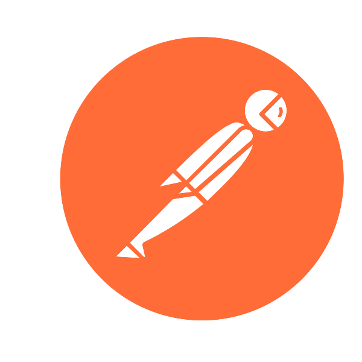

### Меня зовут Александр, я автотестировщик на Python.

#### В своей работе использую следующие технологии:

* **Selenium** - Инструмент для автоматизации тестирования веб-приложений, который позволяет создавать и запускать тесты для веб-интерфейсов.
* **Selene** - Удобный инструмент на Python для автоматизации тестирования, который облегчает написание и поддержку тестовых сценариев.
* **Python** - Язык программирования, используемый для написания автоматизированных тестов, особенно в области веб-тестирования.
* **Allure** - Фреймворк для создания стильных и информативных отчетов по результатам автоматизированных тестов.
* **Allure TestOps** - Платформа для управления тестами, где можно анализировать, отслеживать и организовывать результаты автоматизированных тестов.
* **GitHub** - Платформа для хранения и управления исходным кодом проекта, включая автоматизированные тесты.
* **Selenoid** - Контейнеризированный браузерный фреймворк для запуска автоматизированных тестов в изолированных средах.
* **Jenkins** - Система для непрерывной интеграции и доставки, которая помогает автоматизировать процессы сборки и тестирования.
* **Pytest** - Фреймворк для тестирования на Python, предоставляющий простой синтаксис и множество функций для эффективного тестирования.
* **Jira** - Система управления проектами, где можно отслеживать и управлять задачами, включая тестовые сценарии.
* **Appium** - Фреймворк для автоматизации тестирования мобильных приложений, обеспечивающий кросс-платформенную совместимость.
* **Requests** - Библиотека для работы с HTTP-запросами, полезная при тестировании API.
* **BrowserStack** - Платформа для тестирования веб-приложений в облачной среде, обеспечивающая доступ к различным браузерам и устройствам.
* **Postman** - Инструмент для тестирования API, который упрощает отправку и проверку HTTP-запросов.
* **Telegram** - Мессенджер для общения, который также может использоваться для уведомлений и коммуникации в командах тестирования.
 
 

### **Вы можете связаться со мной по электронной почте  d_sagaeva@mail.ru или через [Telegram](https://t.me/Diana_Junior).**